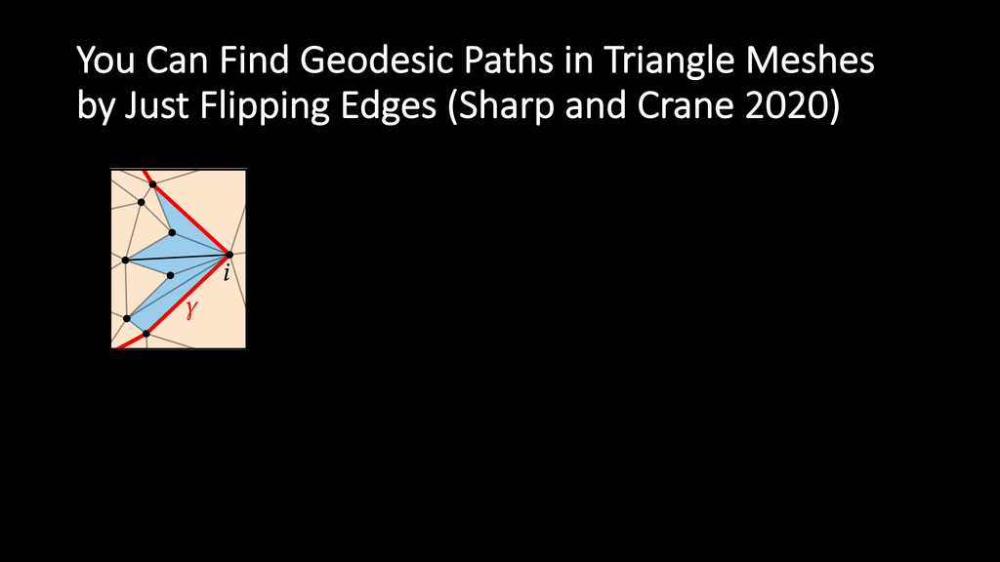
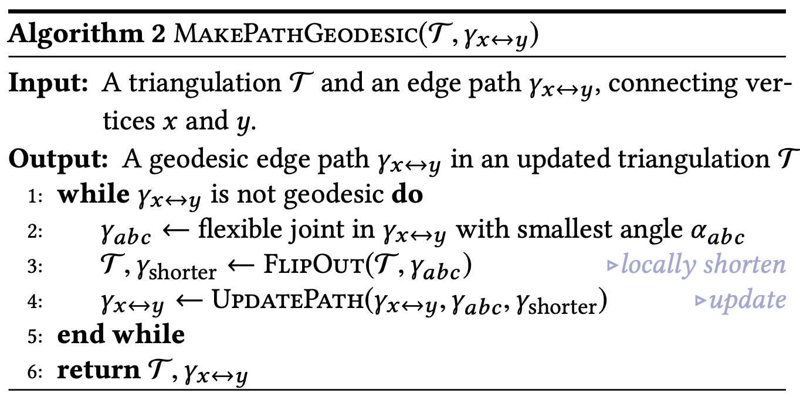
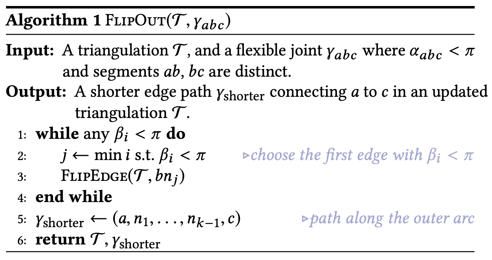
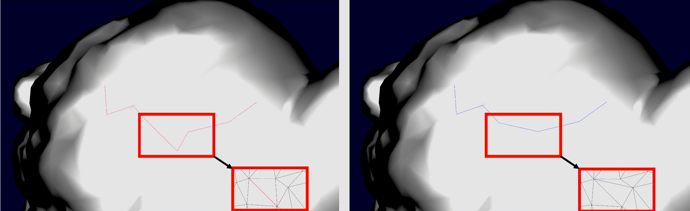

<script type="text/javascript" src="http://cdn.mathjax.org/mathjax/latest/MathJax.js?config=default"></script>

# You Can Find Geodesic Paths in Triangle Meshes by Just Flipping Edges


## Overview


Geodesic is a curve for the shortest path between two vertices in a given surface mesh.
Sharp and Crane [1] introduces a simple algorithm called FlipOut for finding geodesics.

## Algorithm
- An edge ij is defined to be 'flippable' if vertex i and j have degree greater than 1 and the triangles containing ij form a convex quadrilateral when laid out in the plane. FlipOut [1] repeatedly finds an flippable edge that can result in a locally shorter path if flipped and perform an intrinsic edge flip (Algorithm2).



- It finds a joint to be flipped  with vertices a, b, and c, with the help from `calculate_outer_vertices` function that computes the interior angles and finds the outer arc to run the algorithm on:
```
// Given a joint   anchor_vertex -> mid_vertex -> other_anchor_vertex,
// calculate the internal angles for the edges that are connected to mid_vertex and
// lie in between the anchor vertices.
double calculate_outer_vertices(
    int anchor_vertex,
    int mid_vertex,
    int other_anchor_vertex,
    int prev_stop_index,
    int *stop_index,
    std::vector<int> & faces,
    Eigen::MatrixXi & F,
    const Eigen::MatrixXd & V,
    std::vector<int> & outer_arc_indices,
    std::vector<double> & outer_arc_angles
)
```

- The intrinsic edge flip is called the FlipOut process (Algorithm 1), implemented as `flip_out` function:


```
std::vector<int> flip_out(
    const int pathindA,
    const int pathindB,
    const int pathindC,
    const Eigen::Vector3d n,
    const Eigen::MatrixXd & V,
    const std::vector<int> & initPath,
    Eigen::MatrixXi & F,
    std::vector<std::vector<int>> & VF,
    std::vector<int> & outer_arc_indices,
    std::vector<double> & outer_arc_angles

)
```


- At each FlipOut step, `flip_edge` function modifies the edges by changing the faces matrix F and face-adjacency list VF:
```
// Perform an edge flip operation, and modify the face and adjacency list accordingly.
// Return true if successful, false if error occurred
//
// Given:           Output:
//      / v1 \             / v1 \
//    v2  -   vb         v2  |   vb
//      \ v3 /             \ v3 /
//
// Note that edge flip should be 'intrinsic' but currently only implemented as 'extrinsic'
// thus causing some bent faces.
bool flip_edge(
    int v1,
    int v2,
    int v3,
    int vb,
    std::vector<std::vector<int>> & VF,
    Eigen::MatrixXi & F
)
```


## Visualization
- **One step of flip-out:** Notice how the initial path (red) is changed to the shorter path (blue) by flipping one edge:


- The following shows the whole process. It first randomly initializes a path on the mesh (red), and then runs the algorithm to generate the Geodesic (blue):


- More examples:


## Main Function
- 'geodesic_remesh' function first initializes a path from two random vertices in the given mesh. It uses Dijkstra's algorithm to initialize the path.
```
void geodesic_remesh(
    const Eigen::MatrixXd & V,
    const Eigen::MatrixXi & Fin,
    const int i,
    Eigen::MatrixXi & Fout,
    std::vector<int> & initPath,
    std::vector<int> & geodesicPath,
    int doInit
)
```


#### References
1. You Can Find Geodesic Paths in Triangle Meshes by Just Flipping Edges, Nicholas Sharp and Keenan Crane, SIGGRAPH ASIA 2020
